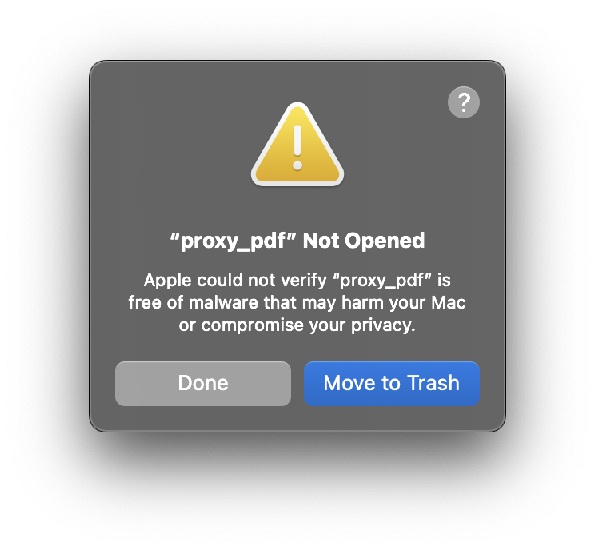
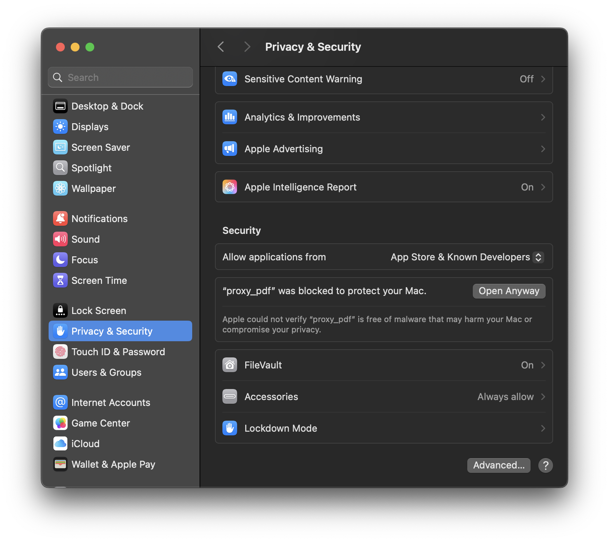
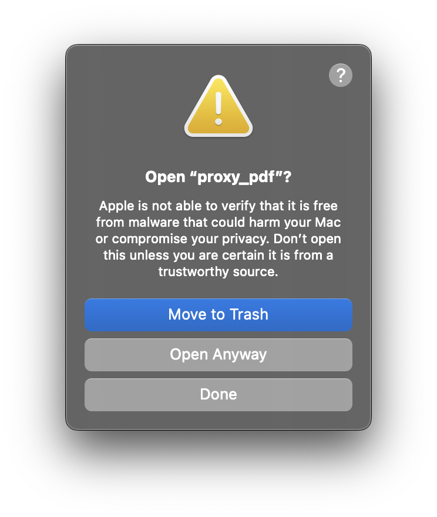
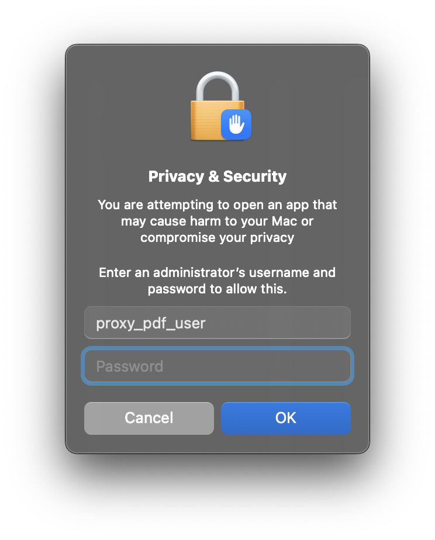

# Installation on macOS
On newer macOS systems, namely macOS 15+, it is not possible to run unsigned apps without jumping through some hoops. The process for this is outlined below. Be sure you only do this with apps you trust!

Once you have extracted the app and try to start it, you will see this:

    

Note that you have to actually try to launch the app once and receive this popup to proceed with the rest of these steps.

This popup is an indication that the app is not signed (because it requires a yearly fee to do this and the maintainer of this repo doesn't even have access to a Mac device to test on). If you trust that the app is not dangerous you can go to the system settings and allow the app to launch. This is done at the bottom of the "Privacy and Security" tab, which looks like this:

    

This will prompt another pop up asking you if you're sure, press "Open Anyway" in this popup:

    

Finally you will be prompted to enter your user and password to finalize the process:

    

At this point, the app should open. Any future launches should not require any additional steps. However once you download a new version you will need to go through this whole process again.
