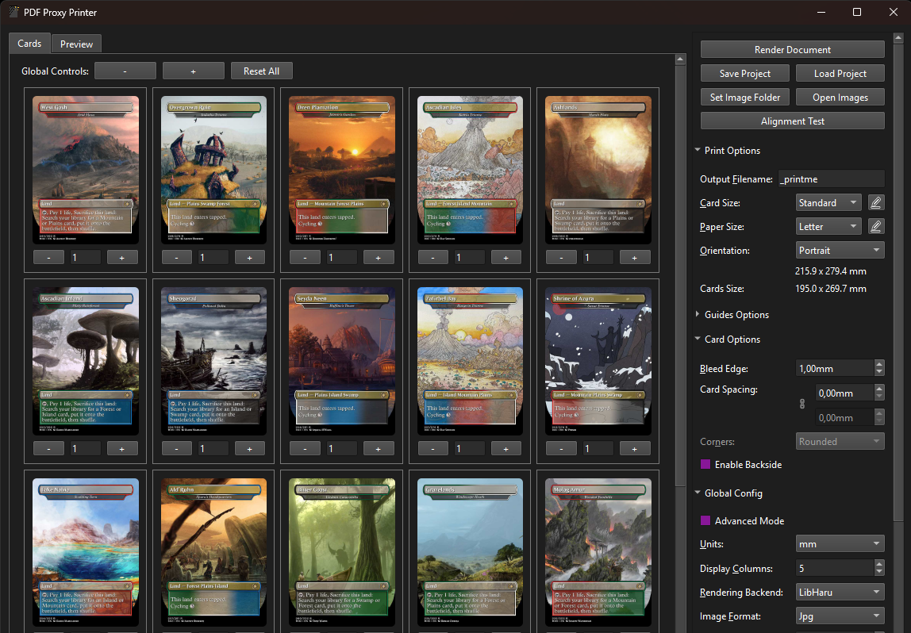
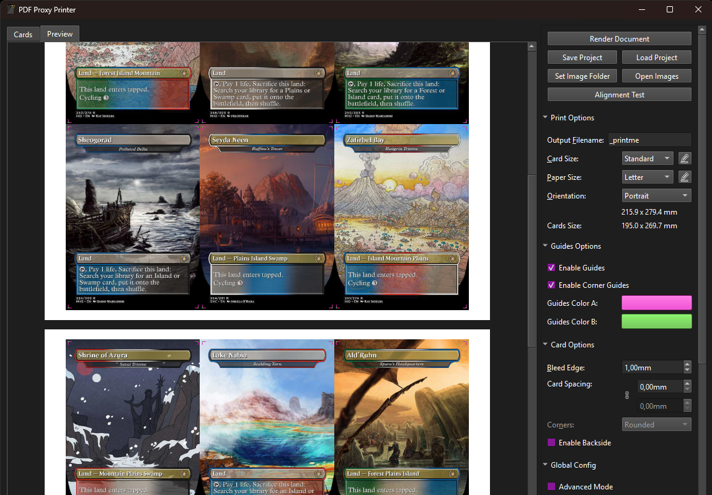
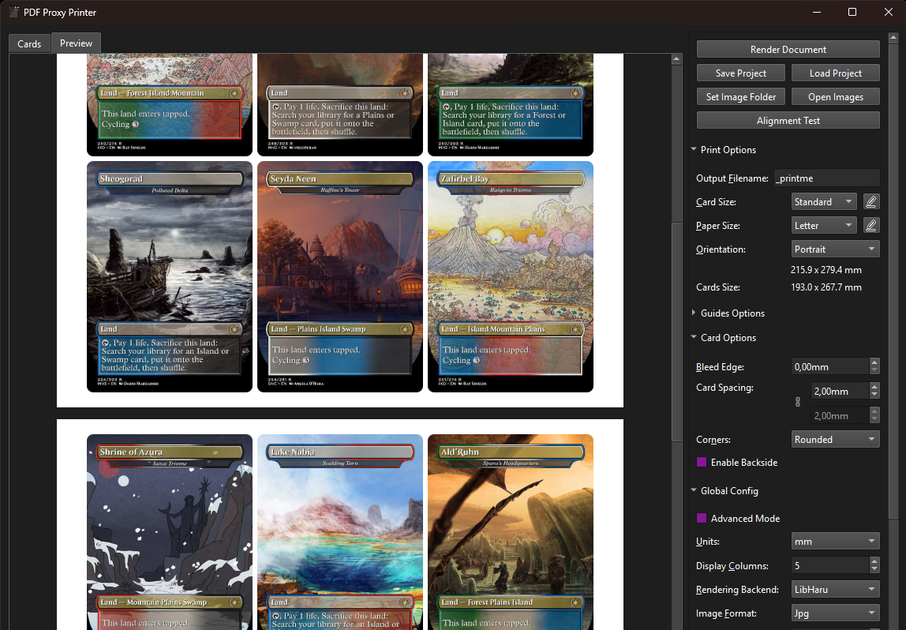
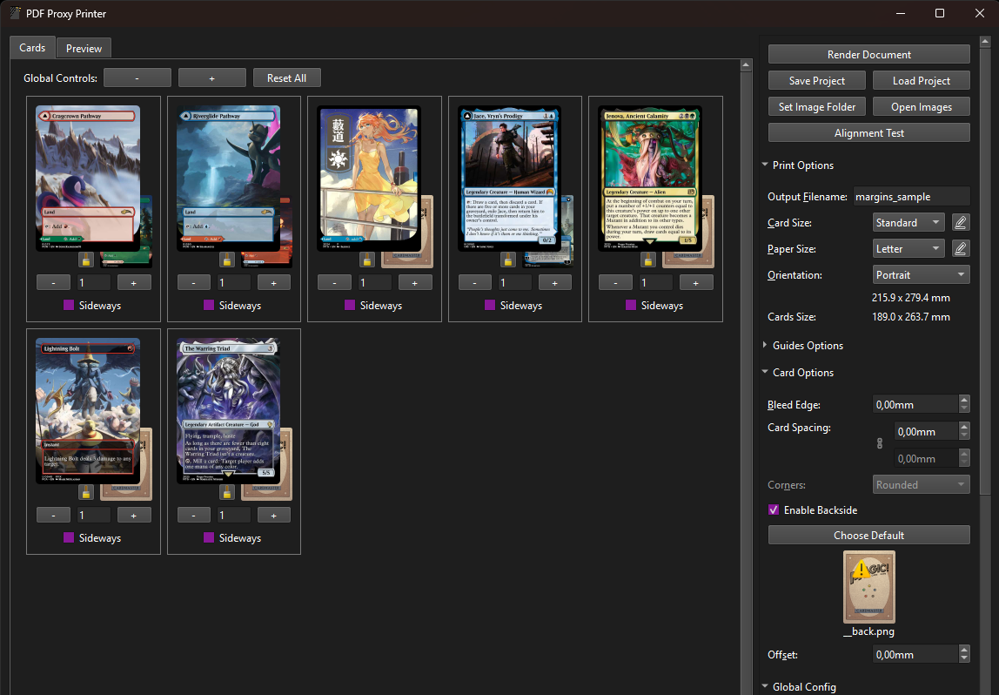
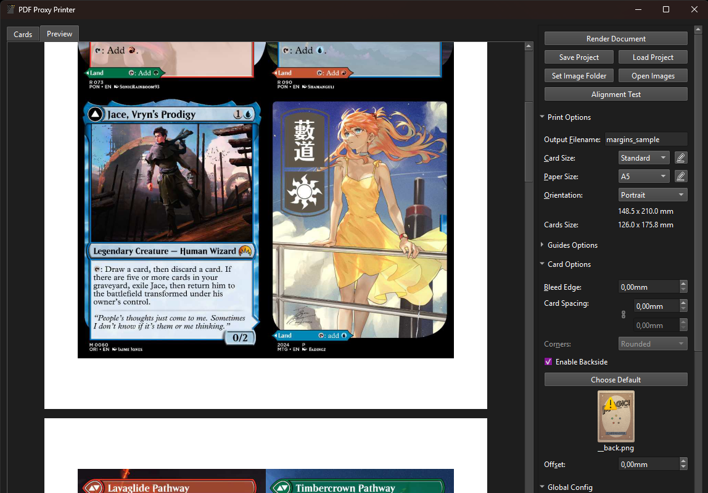
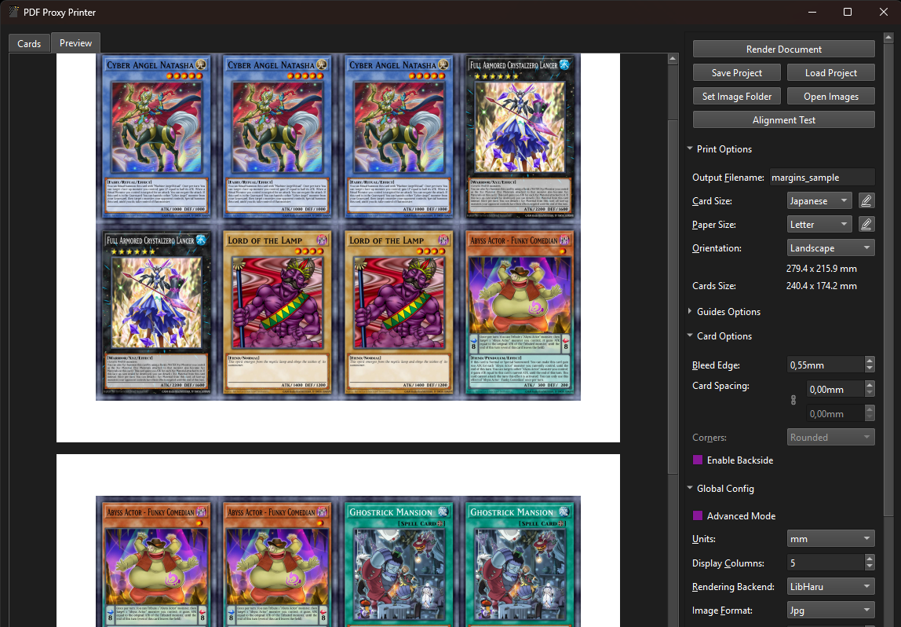

# Proxy PDF Maker

<p align="center">
    <a href="https://isocpp.org/"></a>
    <a href="https://opensource.org/licenses/MIT"></a>
    <br>
    <a href="https://github.com/Malacath-92/Proxy-PDF-Maker/actions/workflows/Windows-CI.yml"></a>
    <a href="https://github.com/Malacath-92/Proxy-PDF-Maker/actions/workflows/Ubuntu-ARM64-CI.yml"></a>
    <a href="https://github.com/Malacath-92/Proxy-PDF-Maker/actions/workflows/Ubuntu-x86-CI.yml"></a>
    <a href="https://github.com/Malacath-92/Proxy-PDF-Maker/actions/workflows/MacOS-ARM64-CI.yml"></a>
    <a href="https://github.com/Malacath-92/Proxy-PDF-Maker/actions/workflows/MacOS-x86-CI.yml"></a>
</p>

Proxy PDF Maker is an app for creating PDF files for at-home printing of TCG Proxies. It handles cropping of bleed edges, alignment on pages, cutting guides, matching backsides, and more. This repo is a complete rewrite of [print-proxy-prep](https://github.com/preshtildeath/print-proxy-prep) app, which was written in Python. This app is instead written in C++ to get better performance, and allow easy distribution of binaries.

# Installation

Go to the [Releases](https://github.com/Malacath-92/Proxy-PDF-Maker/releases) page and grab the latest version for your platform. Unzip this into any folder of your choice and you should be good to go.

On Windows you will additionally have to install Visual Studio Redistributable: https://aka.ms/vs/17/release/vc_redist.x64.exe

# Quick-Start Guide

> [!NOTE]
> This app was initially designed to work with card images that include a bleed edge. However it should be able to handle images without bleed edge by generating it on the fly. Be aware though that this is done based on aspect-ratio, so the images need to align as good as possible to avoid stretching and squishing. Card size and bleed edge can be further configured by users and changed per-game.

The following is an outline for creating your first project:
- Start the app, ideally by just double-clicking the executable.
- Add images either by
    - copying/moving them into the `images` folder that was created for you or
    - dragging image files directly onto the app window.
- Set the amount you want for each card by pressing the `+` or `-` buttons for each card.
- Open the preview by pressing it in the top-left corner of the app window and verify everything is as you want.
- Press the `Render PDF` button in the top-right corner that will appear once the loading bar is done.
- Wait for rendering to be finished, the rendered pdf should be opened automatically.

From here you have to explore the different options the app has to offer on the right-hand side. Be sure to always have the preview open while changing values there so you know how the final pdf will be affected.

<p align="center">
    
    
    <br>
    This is how a project may look like once images are loaded and the corresponding preview, giving an idea of how the pdf looks like when rendered
</p>

<p align="center">
    
    <br>
    Here the user has changed some settings, set corners to be rounded and added spacing between cards, they are able to see the changes live in the preview
</p>

> [!NOTE]
> Images starting with `__` will not be visible in the program. These can however still be used as backsides for other cards.

<p align="center">
    
    
    <br>
    The project shown here has backsides selected for some cards and the preview for the generated pdf with chosen backsides
</p>

<p align="center">
    
    <br>
    The app supports arbitrary card sizes, here shown with YuGiOh cards
</p>

Following is an outline of the different parts of the app and most importantly the many options that you can work with.

## Card Grid
The left half of the window contains a grid of all cards you placed in the `images` folder. Below each image is a text input field and a `+` and `-` button, use these to adjust how many copies for each card you want. On the top you have global controls to `+`/`-` all cards or reset them all to 0.

## Print Preview
On the top-left you can switch over to the `Preview`, which shows you a preview of the printed page. It should update automatically when you change printing settings on the right.

## Context Menu
If you right-click a card in either the Card Grid or the Print Preview you will open the card's context menu. In this menu you will see various options for the card:
- _Remove External Card_: Removes the card from the project. **Only visible if the card is an external card.**
- _Reset Backside_: Resets the backside for this card back to the default. **Only visible if the card has a non-default backside and backsides are enabled.**
- Bleed Options:
    - _Infer Input Bleed_: Default setting. The app will try to determine whether the image has a bleed edge or not.
    - _Assume Full Bleed_: The image has a full bleed edge.
    - _Assume No Bleed_: The image does not have any bleed edge.
- Aspect Ratio Options: **Only visible if the image has an unexpected aspect ratio**
    - _Reset Aspect Ratio_: Reset the aspect ratio to the images original aspect ratio.
    - _Fix Aspect Ratio: Expand_: Expands the image in one dimension to make it have the expected aspect ratio.
    - _Fix Aspect Ratio: Stretch_: Stretches the image in one dimension to make it have the expected aspect ratio.
- _Rotate Left_: Rotates the image by 90 degrees counter-clockwise.
- _Rotate Right_: Rotates the image by 90 degrees clockwise.

## Options
The right panel contains all the options for printing. Those that are self-explanatory (i.e. PDF Filename, Paper Size, Orientation) are skipped here. Also note that all options that affect the generated pdf will be reflected in the print preview, so keep that open while changing the settings to get an idea of what you are doing.

> [!NOTE]
> Some options are hidden by default and are only visible when enabling `Advanced Mode`, all such options are marked.

### Print Options
These options control the format of the output, both the final pdf as well as the cropped images.

#### Card Size
The options for this are defined in `config.ini`, but can be edited via a popup that appears when pressing the  button next to it. The different columns are explained below.

##### Card.Size
This is the physical size of the card once printed and cut to size. Note that if the input has a different aspect ratio the image will be stretched to accommodate.

##### Input.Bleed
This is the physical size of the bleed edge present on the input images. If you only know this in pixels you can calculate it in physical units. For example when
- the input image is 680x880 pixels,
- the card size is 30x40mm,
- and the input image has 40 pixels of bleed edge on each side.
Then the `Input.Bleed` value is 2mm. The full calculation is as follows:
```py
card_width = 30 mm
image_width := 680 pixels
input_bleed_in_pixels := 40 pixels
cropped_image_width = image_width - 2 * input_bleed_in_pixels = 680 - 2 * 40 = 600
pixels_per_mm = cropped_image_width / card_width = 600 / 30 = 20
input_bleed = input_bleed_in_pixels / pixels_per_mm =  40 / 20 = 2
```

##### Corner.Radius
This is the radius of the corners, not that this affects the size of the cutting guides to avoid the guides overlapping the image once corners are clipped.

##### Usage.Hint
Tooltip shown to user when they hover the option, mainly useful for options that are valid for multiple games.

#### Paper Size
Determines the size of a page in the generated pdf. Page sizes are defined in `config.ini`, but may also be edited by pressing the  button next to it.

##### Paper Size: Fit
The `Fit` option for paper size will fit exactly `A` times `B` cards, without any margins whatsoever. The choice of `A` and `B` is made in the option that will appear below the `Paper Size` option once `Fit` is selected. Check out the preview for an idea of how this ends up.

##### Paper Size: Base Pdf
It will load all pdf files inside the folder `res/base_pdfs` and present them in the drop-down below. When rendering the first page of the selected pdf will be used as a base for each page in the output. This is useful for example when using an automatic cutting machine to add registration marks to each page automatically.

#### Cards Size
Gives you information about how big the cards will be once printed, this is the full grid per-page. Not the individual cards.

#### Margin Mode [Advanced Mode]
Determines how the margins are determined, giving the following options:

- `Auto`: Automatically compute the margins to be as small as possible.
- `Simple`: Allow changing top-left margins only, giving the option to offset the cards.
- `Full`: Gives control over all margins, allowing to offset the cards and also reduce the amount of cards on the page.
- `Linked`: Gives control over a single value and forces all margins to be that value. Useful for example when working with setups where specifications require specific margins.

#### Card Orientation [Advanced Mode]
This allows you to choose whether you want the cards to be upright (`Vertical`) or rotated (`Horizontal`). This is an alternative to generating the pdf in portrait or landscape. The third option (`Mixed`) tries to fit as many cards as possible upright, then tries to fill the remaining space with rotated cards.

If you want to reduce the amount of cards, e.g. because your printer has a lower margin than the automatically computed layout allows, this option is very useful. Set `Margin Mode` to `Full` and `Card Orientation` to `Mixed`. Now you can increase the bottom margins, which will force the bottom row to be turned and give you much bigger margins. From there you can modify the top margins to get those where you need them.

#### Flip On [Advanced Mode]
This option is only relevant if you print with backsides, in which case it is used to determine whether you will flip the paper on the left edge or the top edge.

### Guides Options

#### Export Exact Guides [Advanced Mode]
Enables exporting an `.svg` file next to the exported `.pdf` which contains exact guides of the cards, including rounded corners. These can for example be imported into software that operates automatic cutting machines (e.g. Silhouette Studio).

#### Enable Guides
Enables cutting guides, by default those are black-white guides. They are always in the corners of the cards to mark the exact size of a card.

#### Enable Backside Guides [Advanced Mode]
Determines whether guides will be visible on the pages containing backsides of cards.

#### Enable Corner Guides
Determines whether guides are rendered in the corner of each card.

#### Cross Guides [Advanced Mode]
This determines whether the guides are cross-shaped or L-shaped. If L-shaped they will "embrace" the card to make it easy to see which side of the guide is the card and reduce overlap of guides. This option is disabled when the `Corner Guides` option is disabled.

#### Guides Offset [Advanced Mode]
This will determine where the corner guides will be placed. At 0mm the guides will align exactly with the card edges, meaning the center of the guide will align with the card edge. If you want to avoid the potential error of having the guides be too long and thus showing after rounding off the corners, or if you plan to print (near-)rectangular cards, then it is advised to set this option to half the guides thickness. This option is disabled when the `Corner Guides` option is disabled.

#### Guides Length [Advanced Mode]
This determines the length of the guides, with cross-guides this is equivalent to half the size of the cross. It defaults to half the cards corner radius, if made too long you may risk that the guides intrude on the actual cards print are, unless you offset the guides to account for this. This option is disabled when the `Corner Guides` option is disabled.

#### Extended Guides
Renders cutting guides in the border of the rendered pdf to the very edge of the page, will require a tiny bit more ink to print but makes cutting much easier.

#### Guides Color A/B:
Guides are dashed lines made from these two colors. By default these are black and light gray. Choose colors that fit best for the cards you are printing.

#### Guides Thickness [Advanced Mode]
This determines how thick the guides are, it defaults to 1 point, which is equivalent to 1/72 inches.

### Card Options

#### Bleed Edge
Instead of printing cards perfectly cropped to card size this option will leave a small amount of bleed edge. This emulates the real printing process and thus makes it easier to cut without having adjacent cards visible on slight miscuts at the cost of more ink usage.

#### Card Spacing
With this option you can add a gap between cards. This may be an alternative to adding a bleed edge or may be used in conjunction to have decent spacing and only a small amount of ink waste. Use the 🔗 symbol to specify different horizontal and vertical spacing, be sure to verify in the print preview what you are doing.

#### Corners
When `Bleed Edge` is set to zero this option becomes available. It allows you to choose whether the generated pdf should output with the cards' corners already rounded off. This may be especially useful for Scan & Cut scenarios.

#### Enable Backside
Adds a backside to each image, which means when printing each other page will automatically be filled with the corresponding backsides for each image. This allows for double-sided cards, different card backs, etc.

The default backside is `__back.png`, if that file is not available a question mark will be shown instead. To change the default just click on the `Default` button and browse to the image you want.

To change the backside for an individual card, click on the backside for that card in the card grid and browse to the image you want.

#### Backside Offset
In some cases one can't use Duplex Printing, either because the printer doesn't support it or the print medium is too thick. In those cases you'll have to manually turn the page between front- and backside prints. For many printers this will result in a slight offset between the two sides that is more or less consistent. Do a test print to measure this difference and insert it into the `Backside Offset` field.

### Global Config

#### Units
This determines what units all measurements are displayed in. The option `points` refers to the unit used in typography and is likely irrelevant for most users.

#### Display Columns
Determines how many columns are displayed in the card grid on the left. Smaller numbers are better for smaller screens.

#### Render to Png
Sometimes you may want to render out `.png` files instead of `.pdf` files. This is particularly useful when using the `Fit` paper size option, then using the result outputs for manually creating a print layout in another software. Note that each page will be output to a separate file, including backsides.

#### Image Format
This determines whether images are encoded to `.png` or `.jpg` before writing them to the PDF. Use `Jpg` to reduce file size.

#### Jpg Quality
This lets you change the quality of jpg files embedded in the PDF. Lower numbers will reduce file size at the cost of image artifacts appearing. Even at `100` the file size will be significantly smaller than encoding to `.png` files.

#### Color Cube
Dropdown of all color cubes found in the folder `res/cubes`, which have to be `.CUBE` files with an arbitrary resolution. Higher resolutions will not slow down application of the cube maps, trilinear interpolation is used irrespective of resolution. Ships with the following color cubes:
- Foils Vibrance: When printing onto holographic paper/sticker/cardstock use this color cube to get a more vibrant looking result.

#### Preview Width
Determines the resolution of previews in the card grid and the page preview. Smaller numbers result in faster cropping but worse previews.

#### Default Page Size
Dropdown to choose the default page size when creating a new project.

#### Theme
Choose a theme from among all themes found in the folder `res/styles`, which have to be `.qss` files. Predefined themes are:
- Default (OS specific)
- Fusion
- Wstartpages
- Material Dark
- Darkeum
- Combinear

#### Plugins
Opens a window with all available game-specific plugins. Use the checkboxes to enable or disable the plugins.

## Actions
At the top of the options you can see an untitled section, which are all buttons that perform various actions.

### Render PDF
When you're done getting your print setup, hit this button and it will make your PDF and open it up for you. Hopefully you can handle yourself from there.

### Save Project
Saves your project (which includes _all_ settings except for those under `Global Config`), lets you choose any filename to save to such that you have multiple projects ready to go. The last saved project will be auto-opened the next time you start the app.

### Load Project
Loads a project previously saved via `Save Project`.

### Set Image Folder
Lets you choose a folder in which you have your images, this is saved with the project.

### Open Images
Opens the image folder for this project in a file explorer.

### Alignment Test
Generates a small two-page pdf file which you can print and then use to verify your settings. The two settings you have to verify are that you are printing at the right scale and that front- and backsides are well aligned.

# CLI
The app also ships with `proxy_pdf_cli`, which is a command line interface to run cropping and generation. If you don't know what this means then this is probably not for you. With all the features available in the app it should be possible to generate sheets without large amounts of effort. But it's possible to change all project properties via the CLI, please refer to `--help` for more details.

# Donations

I provide this app free of charge and work on it as a hobby and I have no running costs other than the time I spend on it. I use it myself as well, so it's existence is not dependent on it having other users. As such there is no need to monetize this app and I have no plans to sell it as opposed to having it freely available. Despite all this I have had numereous users asking to contribute financially to the project via a donation. So if you are one of those users, feel free to contribute with any amount to buy me a coffee or contribute to a christmas present, I greatly appreciate these contributions. Everyone else, pleaes don't feel any obligation to spend any money on this project.


<p align="center">
  <a href="https://www.paypal.me/Malacath92/5USD">
    
  </a>
</p>

# Troubleshooting:
- If you need support for a new feature, please open an Issue. Press F1 to get an about window, this contains information about the program and a link to the issues page. If you report an issue include a screenshot of this window.
- The program will automatically save if you close the window. It will not save if it crashes! The data is stored in `proj.json`.
- `images/crop/preview.cache` is a file that stores data for the thumbnails.
- If the program crashes on startup first try to delete these two files, if that doesn't do it open an issue.
- When opening an issue to report a bug, please attach a zip file containing your `images` folder and `proj.json`. Also include a screenshot of the F1 window if you can still start the program.
