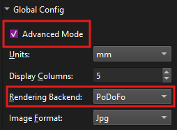

# Why use a Cutting Machine

Many players making proxies for their favorite game (or even their own card games) use a guillotine or rotary cutter, a corner cutter, maybe even scissors. All those methods are very functional and give good results after getting used to them. However a cutting machine or plotter can give much more consistent results. Thus many players like to cut their proxies with a cutting machine.

There are a multitude of automatic cutting machines available to end-users. Common ones are provided by _Silhouette America_, _Cricut_, or _Siser_. They all use their own software for creating designs, in this tutorial we will focus on _Silhouette Studio_ and _Cricut Design Space_, which are the design apps used for Silhouette America and Cricut respectively, but it should be possible to translate the few steps within the design app to other brands.

## Prerequisites
Make sure you downloaded the latest version of [Proxy-PDF-Maker](https://github.com/Malacath-92/Proxy-PDF-Maker/releases).

Additionally you will have to install Visual Studio Redistributable: https://aka.ms/vs/17/release/vc_redist.x64.exe

Do the usual steps to create your project, use the preview to verify everything would print as you want.  If you want to follow along this tutorial exactly, download the images in the folder `tutorial_cards` folder and load the project `sample_project.json`.

## Setting up the _Silhouette Studio_ Project

To setup the project we need to generate a the cutting guides from the app. We do this by enabling `Advanced Mode` in the `Global Config`, and while we're here we also switch the `Rendering Backend` to `PoDoFo`1.

    
     
    1Global options required for this guide

Next we will be disabling guides and enabling `Export Exact Guides` in the `Guides Options` section2.

    
     
    2 Disabled guides but exporting exact guides

Now we can press `Render Document`, this will generate a `_printme.svg` file which has the exact card guides. In addition we should have a `_printme.pdf` which we won't really need, but you can use it to verify that the svg and the pdf output match.

> [!NOTE]
> Depending on what cutting machine you use you may have to set the `Paper Size` to `Fit`, `Card Orientation` to `Mixed` and play around with the vertical and horizontal layout values to get something that fits within the valid region of your registration marks.

Now we can open a new project in _Silhouette Studio_ and choose the right page setup3. At this point we can drag-n-drop the `_printme.svg` or the `_printme.dxf` file into the project. Copy the `Cards Size`4 values over to the size of the imported cutting guides(note that this should be already correct if using `_printme.dxf`) and press the `Center to Page` option5.

    
     
    3 Page setup in Silhouette Studio for the sample project

    
     
    4 Cards size in app, note that this respects spacing and bleed options correctly

    
     
    5 Resizing and centering guides in Silhouette Studio

Next select the `Print & Cut` option, enable registration marks and set them up so that the cross-hatched area does not overlap the cutting guides as little as possible6. At this point we can print the document to a pdf, name it `cutting_base.pdf` and save it to the `res/base_pdfs` folder. This folder should be created for you already, relative to the working directory (which should be the same folder that the `.exe` is in), although it might be empty.

    
     
    6 Print & Cut settings for the sample project

While we are here we can also disable the outer-most cutting line. Right-click the outlines and choose `Release Compound Path` if you imported an `.svg` or `Ungroup` if you imported a `.dxf`7, then select only the outer guides and delete them. Now select all the guides again, right-clock and choose `Make Compound Path`.

    
     
    7 Splitting cutting guides into separate paths

## Generating the full PDF in the App

> [!NOTE]
> You currently have to restart the app for this step, but that will be fixed in the future

First go to the `Global Config` and choose `PoDoFo` for the `Rendering Backend` option.

Now we change `Paper Size` to `Base Pdf`, which then shows another dropdown which we want to choose our pdf from, i.e. `cutting_base`8. This will generate all the pages on top of the base pdf, so the registration marks are automatically there. They will also show up on the backside, but we can't cut with the backside up as we probably have to fix the offset to align correctly.

    
     
    8 Setting up the Base Pdf option

Since we centered the cutting guides on the page we don't need to do anything else. If you however moved the guides on the page, be sure to check `Custom Margins` and paste the margins from within _Silhouette Studio_ into the margins field (`X` into `Left Margin` and `Y` into `Right Margin`).

Lastly you can now press `Render Document` to generate the pdf.

## Doing the Print & Cut

Lastly you just print as usual, laminate, sticker, whatever you like. Then you place your prints on the mat, insert into your machine and send the cutting instructions. The actual settings, tools, and method for cutting highly depend on your material and machine, so we won't go into details about that here.

## _Cricut Design Space_ Specific Instructions

### Initial Setup

Follow the Silhouette Studio instructions up to rendering the document. Make sure you only have `Export Exact Guides` enabled under `Guides Options`. It's recommended to set margins to at least 1.25 cm, but we recommend setting margins to around ~2.5 cm for reasons explained later.

### Creating the Cricut Project

1. Open a new project in _Cricut Design Space_ and upload the `_printme.svg` file
2. Click on the Cut Guides, and in the top bar, set Operation to 'Print Then Cut' and unlock the Size
3. Copy the values from `Cards Size` within the `Print Options` section
> [!NOTE]
> You may have to go to Settings and Canvas and set Units to Metric. The size in the bar will be in centimeters, so for example, 268.0 mm should be set to 26.8 within Cricut. Alternatively you can change the display units in the app under `Global Config`.

### Configuring Page Settings

1. Go to Settings and select the Load Type menu
2. Set Print Then Cut Page Size to the paper size you plan to print onto
> [!Important]
> The Load Type setting will use whatever mat you decide to use which is important because Cricut must recognize the mat length. Ensure the mat fits the paper

### Setting Up the Print Area

1. Click Make and set the box in the Upper Leftmost corner
2. If you have lots of margin space, leave the box as is for easy future replication

### Configuring Print Settings

1. Click Continue
2. Under 'Printed', click 'Send to Printer' and select Printer: Microsoft Print to PDF
3. If you are not using tabloid/ledger paper, also click 'Use System Dialog'
4. Click Print
5. In the System Print pop up:
   - Set Printer as Microsoft Print to PDF
   - Click Preferences and select the proper orientation
   - Click Advanced and set the proper paper type
   - Click OK and Print

### Finalizing the Base PDF

_This section is a summarization fo the 'Generating the full PDF in the App' section._
1. Save/Move the file to `res\base_pdfs` within the Proxy-PDF-Maker folder
2. Restart Proxy-PDF-Maker
3. Reopen and set Rendering Backend to PoDoFo
4. Set Paper Size to Base Pdf and set Base Pdf to your proper file
5. Set the margins to what you set them to previously

### Fine-tuning Alignment

1. Click Render Document and look at the resultant PDF
2. Continue adjusting margins until the lines are perfectly aligned
3. Save the final PDF

### Printing and Cutting

Print the PDF with full page and insert it into the Cricut. Follow the onscreen instructions.
