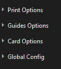
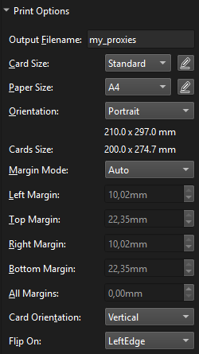
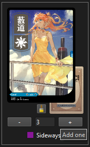
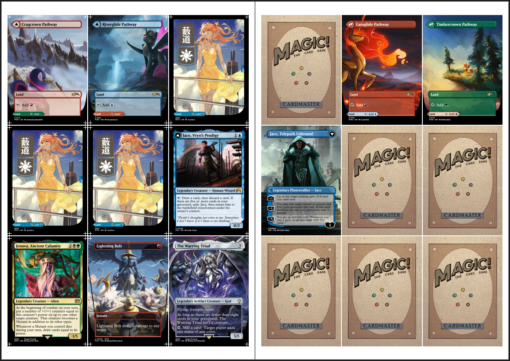

> [!NOTE]
> All sample images for this have an input bleed edge, be sure to pay attention to the [Notes on Bleed Edge](#notes-on-bleed-edge) section to verify and correctly handle your images

# LiberProxies

LiberProxies is a EU-based print-service that offers high-quality proxies at reasonable prices. Generally it is enough to choose cards and a set they were printed on to order your proxies. It is also possible to order prints of custom-created proxies by just sharing those as image files. In case of requesting custom-created double-sided cards however LiberProxies requires that you share a print-ready document with them.

This tutorial focuses on creating such print-ready documents.

## Prerequisites
Make sure you downloaded the latest version of [Proxy-PDF-Maker](https://github.com/Malacath-92/Proxy-PDF-Maker/releases).

Additionally you will have to install Visual Studio Redistributable: https://aka.ms/vs/17/release/vc_redist.x64.exe

Then collect all images of cards you want to order and a back-side you like. Rename the back-side image to `__back` in order to simplify later steps.

If you want to follow along this tutorial exactly, download the images in the folder `tutorial_cards` folder.

### Card Images

Next to the `proxy_pdf` executable, create a new folder and name it `liberproxies` and paste all your cards into it.

## App Setup

Start up the `proxy_pdf` exectuable, it should look something like the below image.

    
     
    If you have used the app before it may already look different

The settings should be visible on the right side of the screen, go ahead and collapse all the sections by pressing the little arrow next to their names.

    
     
    This is how it should look once you collapsed all options

We will now go through all the settings to adjust them to exactly what LiberProxies requires to print.

### Global Config

To start us off, expand the bottom section. Here we want to make sure to:
- set `Units` to `mm`,
- set `Image Format` to `Jpg`,
- set `Jpg Quality` to `100`,
- set `Color Cube` to `None` and
- set `Max DPI` to `800`.

All other options are irrelevant for us.

    

You can now collapse this section again.

### Card Options

Extend this section and set the following options:
- `Bleed Edge` to `1.5mm`,
- `Spacing` to `1mm`,
- tick `Enable Backside` and
- both `Backside Offset` values to `0mm`.

    

Note the spinner above `__back.png`, this just means that the app currently can not find the image. We will fix that once we select the image folder. For now, collapse the section.

### Guides Options

Expand the section and set the following:
- Untick `Export Exact Guides`,
- tick `Enable Guides`,
- untick `Enable Backside Guides`,
- tick `Enable Corner Guides`,
- tick `Cross Guides`,
- untick `Extended Guides`,
- set both colors to pure white (in reality you should adjust these to make sure the guides are well visible for the cards you have),
- set `Guides Offset` to `0mm`,
- set `Guides Thickness` to `0.1mm`,
- set `Guides Length` to `1mm`.

    

Now collapse this section.

### Print Options

Expand the section and set the following:
- Set `Output Filename` to whatever you like (this will be the name of your pdf),
- set `Card Size` to `Standard`,
- set `Paper Size` to `A4`,
- set `Orientation` to `Portrait`,
- set `Margin Mode` to `Auto`,
- set `Card Orientation` to `Vertical`,
- set `Flip On Orientation` to `Left Edge`.

    

### Load Images

Now press `Set Image Folder` at the top and select the `liberproxies` folder. Now all the cards you have in that folder should start loading in. Observe also the loading bar at the top-right, which has to finish before being able to generate the pdf.

    
     
    Some images have already loaded, while some are still waiting

Each tile in this grid represents one card. The small image behind the card represents its back-side. If you did not name your back-side to `__back` then these may not load. If so, go back to the `Card Options` segement and press `Choose Default`, then navigate to the back-side you want to use by default.

### Choosing Double-Sided Cards

For each card in this grid, locate the card that represents the front-side of a DFC. Click on the little image for its back-side and choose the image representing its back-side. The tile representing the back-side should now disappear. If you made a mistake and want to reset a back-side just press on the little broom icon below the card image.

    
     
    Only the front-sides of cards and single-faced cards are left after matching up

### Changing the Amount per Card

Lets say we want to order three copies of the `Plains` card. Simply use the `+` and `-` buttons below the card to increase or decrease the amount per card.

    

### Generating the PDF

Finally we just have to press the `Render Document` button in the top-right and wait for rendering to finish.

    
     
    Once generated you should have a two-page PDF that contains all your proxies with front- and back-sides

